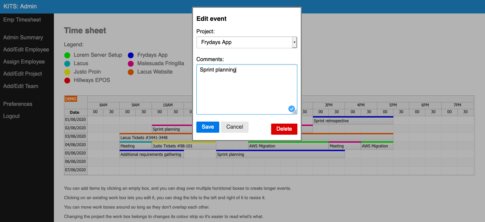
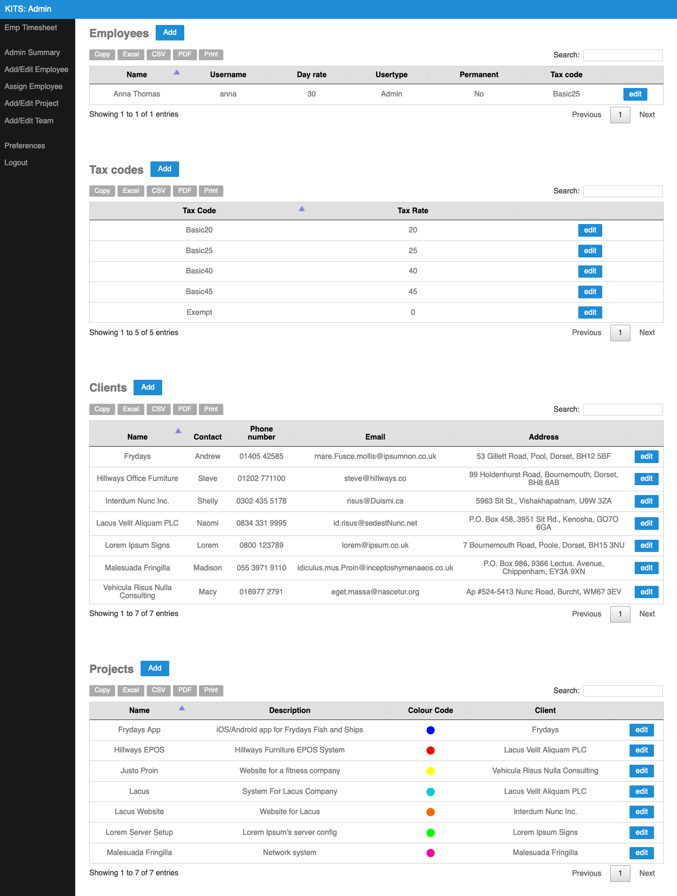

# Timesheet

Proof of concept timesheet webapp created for a University project in a few days

Built on a very minimalistic CMS system called mini3:  
[https://github.com/panique/mini3](https://github.com/panique/mini3)

The calendar uses a trail version of day pilot pro:  
[https://www.daypilot.org/try](https://www.daypilot.org/try)

Table formatting and export functionality is courtesy of data tables:  
[https://datatables.net](https://datatables.net)

The following files were written by myself and need tidying up, but this was relegated due to time constraints and because programming wasn’t marked as part of the assignment:

application/view/*   
application/Model/*  
application/Controller/*  
application/public/css/style.css  

## Installation

1. Run `composer install` from the root folder
2. Run database_create_insert.sql to create and populate the 'kits' database
3. Set your database IP, user and password in application/config/config.php
4. Point your httpd to the /public folder with re-writes enabled

## Login details

User: anna  
Pass: Password123

## Screenshots

